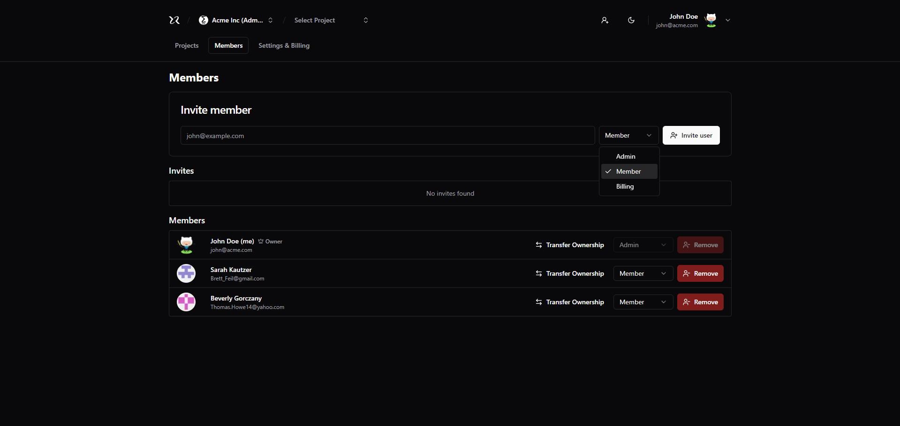

# Next.js SaaS + RBAC  

<br>

<p align="center">
  <a href="#-about-the-project">About the project</a> •
  <a href="#-technologies">Technologies</a> •
  <a href="#-getting-started">Getting started</a> •
  <a href="#-license">License</a>
</p>

<p align="center">
 
 
  
</p>

## 👩‍💻 About the project

This project is a full-stack SaaS platform designed for project management, emphasizing **role-based access control (RBAC)** powered by **CASL**. It allows users to create and manage projects efficiently while providing fine-grained control over permissions and access levels, ensuring secure collaboration across teams.

The platform features a **Next.js 14** front-end, powered by **React 19**, utilizing Server Components and Server Actions for improved performance and scalability. On the back-end, it leverages Node.js, Fastify, and Prisma for high-performance data handling and seamless API communication. By adopting a monorepo architecture with TurboRepo, it streamlines the development process, allowing for faster builds and shared resources between the front-end and back-end.

Key features include:

- **Multi-tenant architecture** for managing multiple organizations and workspaces.
- **Integrated authentication** for secure user login and management.
- **RBAC authorization** for fine-tuned control over user permissions, allowing administrators to assign specific roles with granular access rights.
- **Project and task management** tools, designed for efficiency and collaboration.
- **Member invitations and management**, ensuring easy team onboarding.
- **Detailed billing system**, providing clear usage tracking and billing for organizations.

This project serves as a **boilerplate** for building SaaS applications, with a strong foundation in authentication, authorization, and multi-tenancy. It’s optimized for developers looking to create robust SaaS platforms with modern tooling, security, and scalability built-in.

## Features

### Authentication

- [x] It should be able to authenticate using e-mail & password;
- [x] It should be able to authenticate using Github account;
- [x] It should be able to recover password using e-mail;
- [x] It should be able to create an account (e-mail, name and password);

### Organizations

- [x] It should be able to create a new organization;
- [x] It should be able to get organizations to which the user belongs;
- [x] It should be able to update an organization;
- [x] It should be able to shutdown an organization;
- [x] It should be able to transfer organization ownership;

### Invites

- [x] It should be able to invite a new member (e-mail, role);
- [x] It should be able to accept an invite;
- [x] It should be able to revoke a pending invite;

### Members

- [x] It should be able to get organization members;
- [x] It should be able to update a member role;

### Projects

- [x] It should be able to get projects within a organization;
- [x] It should be able to create a new project (name, url, description);
- [x] It should be able to update a project (name, url, description);
- [x] It should be able to delete a project;

### Billing

- [x] It should be able to get billing details for organization ($20 per project / $10 per member excluding billing role);

## RBAC

Roles & permissions.

### Roles

- Owner (count as administrator)
- Administrator
- Member
- Billing (one per organization)
- Anonymous

### Permissions table

|                          | Administrator | Member | Billing | Anonymous |
| ------------------------ | ------------- | ------ | ------- | --------- |
| Update organization      | ✅            | ❌     | ❌      | ❌        |
| Delete organization      | ✅            | ❌     | ❌      | ❌        |
| Invite a member          | ✅            | ❌     | ❌      | ❌        |
| Revoke an invite         | ✅            | ❌     | ❌      | ❌        |
| List members             | ✅            | ✅     | ✅      | ❌        |
| Transfer ownership       | ⚠️            | ❌     | ❌      | ❌        |
| Update member role       | ✅            | ❌     | ❌      | ❌        |
| Delete member            | ✅            | ⚠️     | ❌      | ❌        |
| List projects            | ✅            | ✅     | ✅      | ❌        |
| Create a new project     | ✅            | ✅     | ❌      | ❌        |
| Update a project         | ✅            | ⚠️     | ❌      | ❌        |
| Delete a project         | ✅            | ⚠️     | ❌      | ❌        |
| Get billing details      | ✅            | ❌     | ✅      | ❌        |
| Export billing details   | ✅            | ❌     | ✅      | ❌        |

> ✅ = allowed
> ❌ = not allowed
> ⚠️ = allowed w/ conditions

#### Conditions

- Only owners may transfer organization ownership;
- Only administrators and project authors may update/delete the project;
- Members can leave their own organization;


[Click here to check out the live application](https://next-saas-cs.vercel.app/) 😉

**Important Notice**: This project is deployed with the backend hosted on Render and the frontend on Vercel. Since the backend is running on Render's free tier, the server may take up to 60 seconds to start after the first request. Render has a usage limit for free-tier projects, but running the project locally should not cause any issues.

## 🚀 Technologies
    
- [casl](https://casl.js.org/v6/en/)
- [dotenv-cli](https://github.com/venthur/dotenv-cli)
- [fastify](https://fastify.dev/)
- [ky](https://github.com/sindresorhus/ky)
- [NextJs v15](https://nextjs.org/)
- [Node.js](https://nodejs.org/pt)
- [postgreSQL](https://www.postgresql.org/)
- [Prisma](https://www.prisma.io/)
- [React v19-RC](https://react.dev/blog/2024/04/25/react-19)
- [shadcn/ui](https://ui.shadcn.com/)
- [Swagger](https://swagger.io/)
- [Tailwind](https://tailwindcss.com/)
- [TanStack Query](https://tanstack.com/query/latest)
- [TurboRepo](https://turbo.build/)
- [Zod](https://github.com/colinhacks/zod)
 
## 💻 Getting started

### Requirements

- [Node.js](https://nodejs.org/en/)
- [NPM](https://www.npmjs.com/)or [PNPM](https://pnpm.io/) _(examples are with PNPM)_
- [React v19-RC](https://react.dev/blog/2024/04/25/react-19)
- [postgreSQL](https://www.postgresql.org/) / [Docker](https://www.docker.com/)


**Clone the project and access the folder**

```bash
$ git clone https://github.com/leandrorodrigues00/next-saas-rbac && cd next-saas-rbac

```

**Follow the steps below**

To run the application, you will need to start the server in the `/apps/api` folder and the web application in the `/apps/web` folder.

```bash
# Install the dependencies in the root folder `/`
$ pnpm i

# Make a copy of '.env.example' to '.env'
# and set with YOUR environment variables.
$ cp .env.example .env

# Use Docker to start the database. If needed, adjust the settings in the `/docker-compose.yml` file:
$  docker compose up 

# Navigate to the apps/api directory and run Prisma commands to set up the database schema and seed the database:
$ cd apps/api 
$ pnpm dlx prisma generate
$ pnpm run db:migrate
$ pnpm run db:seed

# Return to the root of the project and start the development server. TurboRepo will handle the build and start all necessary processes:
$ cd ../..  # Return to the root directory
$ pnpm run dev
```

## 📝 License

This project is licensed under the MIT License - see the [LICENSE](LICENSE) file for details.

---

<p align="center">
  Made with 💜&nbsp; by  Leandro Rodrigues
</p>
